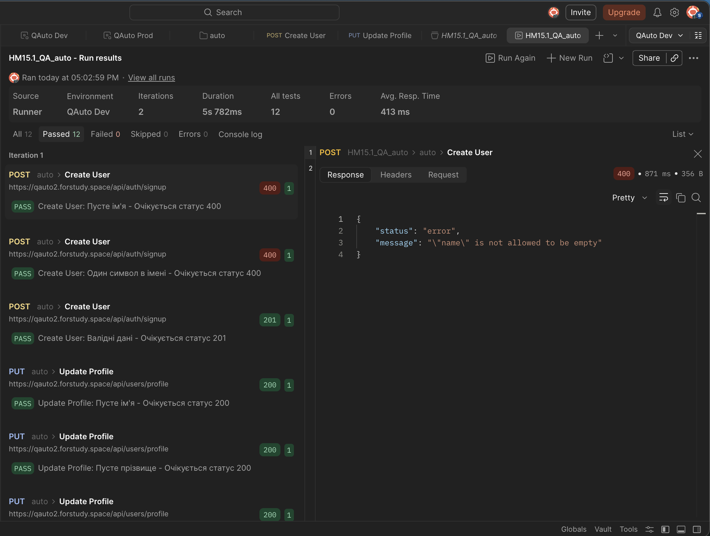
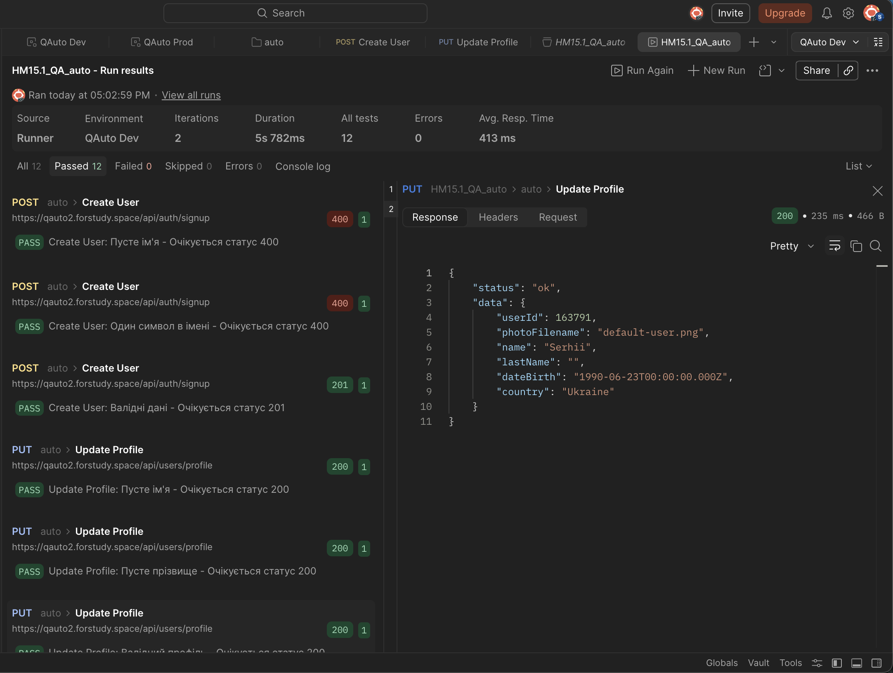

# HW 15.1: Postman Collection Automation 🚀

This repository contains the automation scripts for testing the **QAuto** API. The goal of this homework was to implement efficient, clean, and dynamic API testing using advanced Postman features.

## 📋 Project Overview

The collection automates user registration and profile management across multiple environments using dynamic looping and automated iteration control.

## 🛠️ Key Implementation Details

### 1. Dynamic Request Looping (DRY Principle)
Instead of creating dozens of separate requests, I implemented a logic that cycles a single request through multiple test cases:
* **POST Create User**: Validates various scenarios including empty name fields, minimum character length (1 character), and successful registration.
* **PUT Update Profile**: Dynamically tests profile updates with different data sets (empty name, empty last name, and valid profile).
* **Logic**: Used `pm.variables` for local data handling and `postman.setNextRequest` to control the execution flow.

### 2. Automated Multi-Environment Execution
The collection is configured to run automatically across two different environments in a single session:
* **Environments**: Automated switching between `qauto` and `qauto2`.
* **Implementation**: A Collection-level Pre-request Script detects the current iteration and updates the `url` variable dynamically.

### 3. Variable Scoping & Clean Code
* Used **Local Variables** (`pm.variables`) to ensure high priority and prevent data leakage between runs.
* Implemented **JSON.parse/stringify** logic to manage test case arrays within Postman variables.

## 📊 Test Results

* **Total Assertions**: 12
* **Passed**: 12 ✅
* **Failed**: 0 ❌
* **Iterations**: 2 (Total of 6 requests per environment)

## 📸 Screenshots

### Test Run Statistics

### Detailed Validation Logs

---
