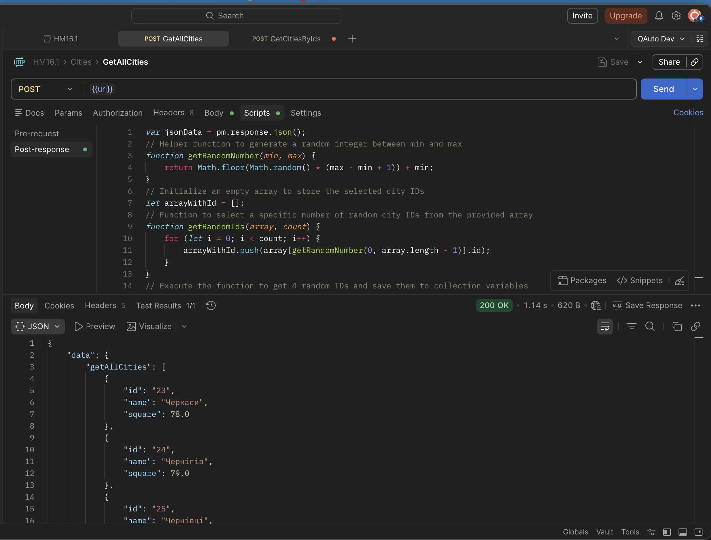
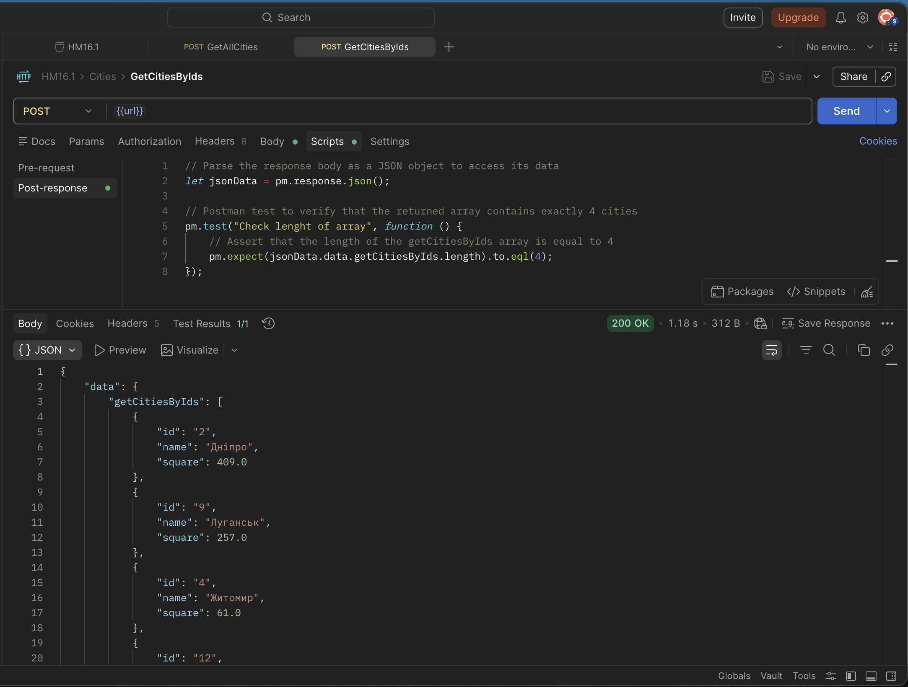
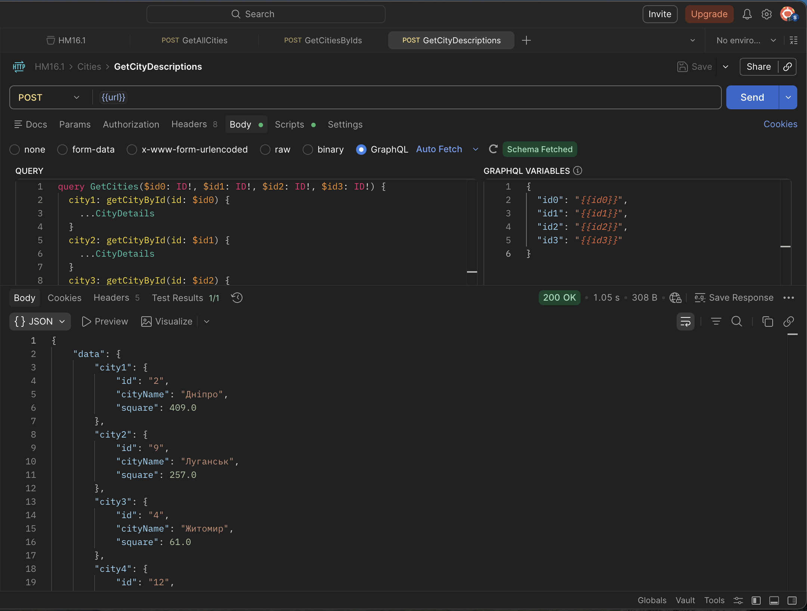
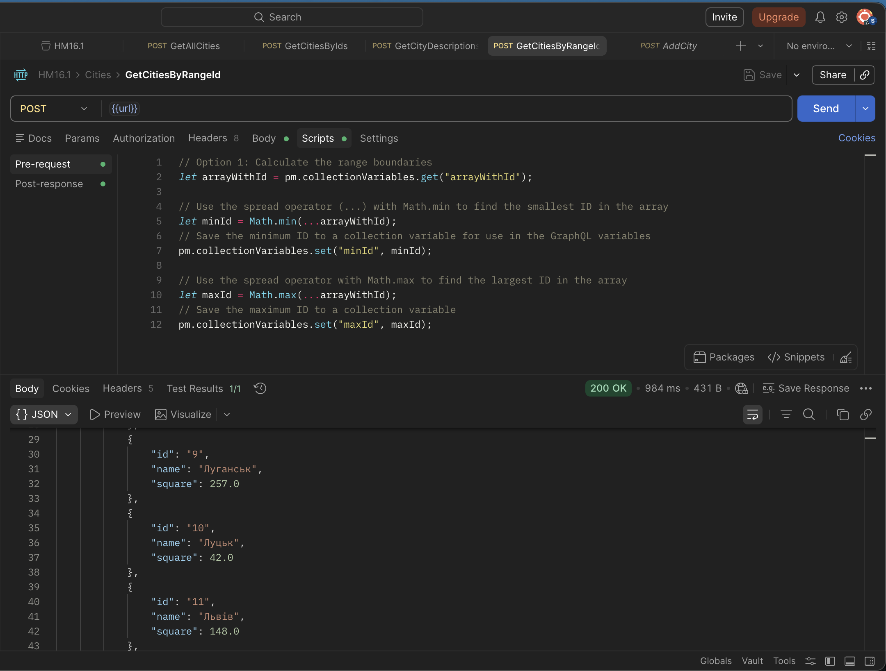
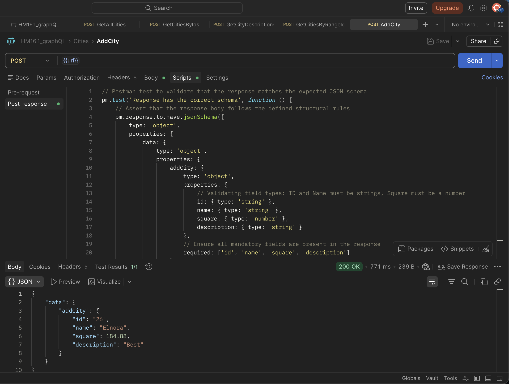
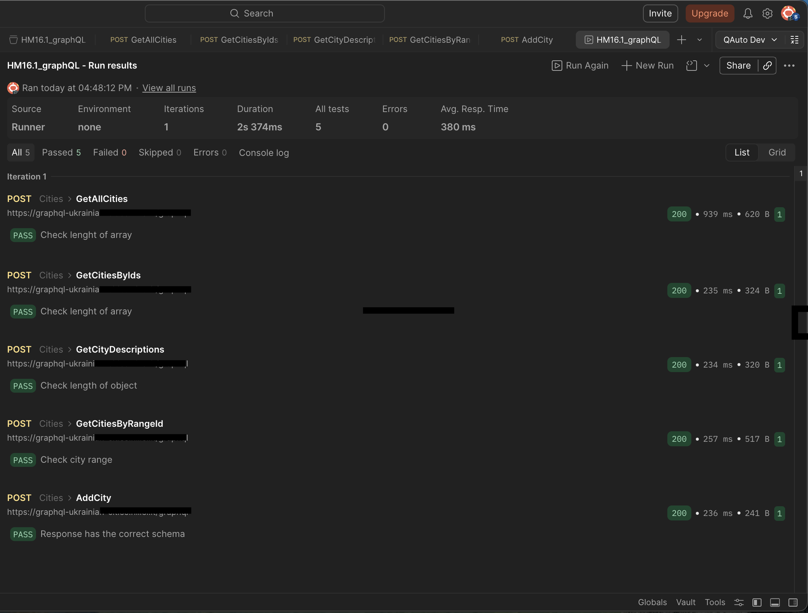
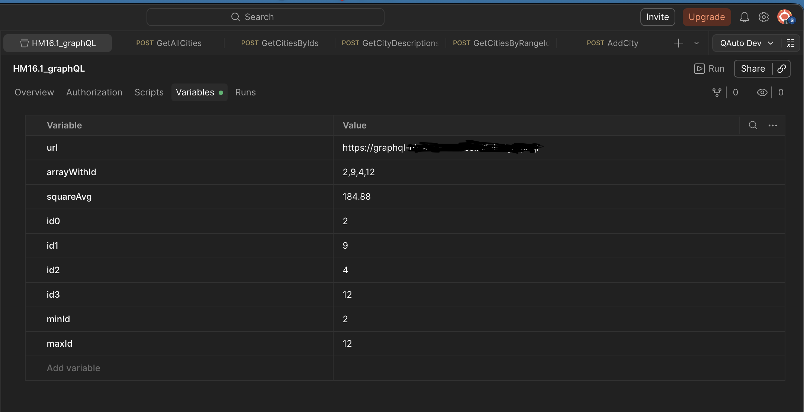

{\rtf1\ansi\ansicpg1252\cocoartf2868
\cocoatextscaling0\cocoaplatform0{\fonttbl\f0\fswiss\fcharset0 Helvetica;}
{\colortbl;\red255\green255\blue255;}
{\*\expandedcolortbl;;}
\paperw11900\paperh16840\margl1440\margr1440\vieww28600\viewh14260\viewkind0
\pard\tx720\tx1440\tx2160\tx2880\tx3600\tx4320\tx5040\tx5760\tx6480\tx7200\tx7920\tx8640\pardirnatural\partightenfactor0

\f0\fs24 \cf0 # \uc0\u55356 \u57305 \u65039  Ukrainian Cities GraphQL API Testing\
\
This folder contains a Postman collection for automated testing of the "Ukrainian Cities" GraphQL API. The project demonstrates practical skills in working with GraphQL (Queries, Mutations), writing `Pre-request` and `Post-response` scripts in JavaScript, managing collection variables, and automating test execution via the Postman Collection Runner.\
\
## \uc0\u55357 \u57056 \u65039  Requirements & Tools\
- **Postman**\
- **GraphQL API Endpoint:** `https://graphql\'85`\
\
---\
\
## \uc0\u55357 \u56960  Test Flow & Execution Steps\
\
### 1. Fetch All Cities (`GetAllCities`)\
A query to retrieve a list of all available cities.\
**Script Logic:**\
- Extracts **4 random IDs** from the response and saves them into the `arrayWithId` array.\
- Calculates the **average square** (area) of all cities and stores it in the `squareAvg` collection variable.\
- Executes a test to verify that the returned array of cities is not empty.\
\
\
\
### 2. Fetch Cities by ID Array (`GetCitiesByIds`)\
A query to fetch specific city details using the array of random IDs saved in the previous step.\
**Script Logic:**\
- Runs an assertion to verify that the server returned data for exactly 4 cities.\
\
\
\
### 3. Fetch Cities via Aliases (`GetCities`)\
An alternative, optimized approach to fetch data for 4 distinct cities in a single request using GraphQL Aliases and Fragments.\
**Script Logic:**\
- Extracts individual IDs from the `arrayWithId` array and assigns them to separate variables (`id0`, `id1`, `id2`, `id3`) before the request is sent.\
- Executes a test to ensure the returned object contains exactly 4 keys (aliases).\
\
\pard\tx720\tx1440\tx2160\tx2880\tx3600\tx4320\tx5040\tx5760\tx6480\tx7200\tx7920\tx8640\pardirnatural\partightenfactor0
\cf0 \
\pard\tx720\tx1440\tx2160\tx2880\tx3600\tx4320\tx5040\tx5760\tx6480\tx7200\tx7920\tx8640\pardirnatural\partightenfactor0
\cf0 \
### 4. Fetch Cities in a Range (`GetCitiesByRangeId`)\
Finds the minimum and maximum IDs among the 4 randomly selected cities and retrieves a list of all cities within this specific range.\
**Script Logic:**\
- Determines the `minId` and `maxId` from the saved IDs array.\
- Tests whether the total number of returned cities strictly matches the expected size of the calculated range.\
\
\
\
### 5. Create a New City (`AddCity`)\
A GraphQL Mutation to add a new city into the database.\
**Data & Logic:**\
- Generates a random city name using Postman's built-in dynamic variable `\{\{$randomFirstName\}\}`.\
- Assigns the city's area using the previously calculated `squareAvg` variable.\
- **JSON Schema Validation:** Performs strict validation of the server response to ensure the data structure and types are correct (e.g., `id` must be a string, `square` must be a number).\
\
\
\
---\
\
## \uc0\u55356 \u57283  Collection Runner\
All requests in this collection are configured for sequential execution without any manual intervention. Data is dynamically passed from one request to another using collection variables. \
The collection successfully passes all tests in **Run Mode**, confirming the accuracy of the scripts and the integrity of the automated test logic.\
\
\
\
---\
\
## \uc0\u55357 \u56771 \u65039  Collection Variables\
During the execution of the scripts, the following environment variables are automatically generated and updated to establish the data flow between requests:\
\
}