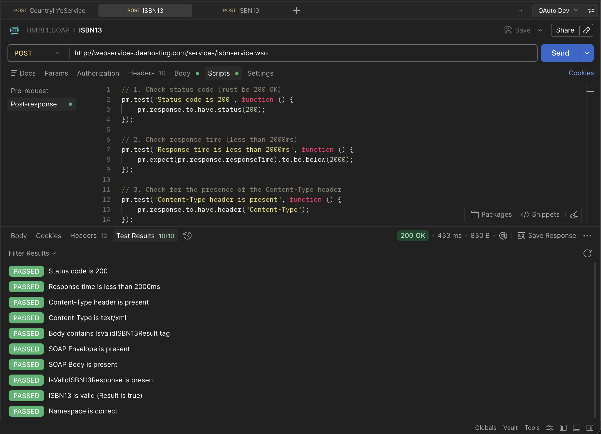
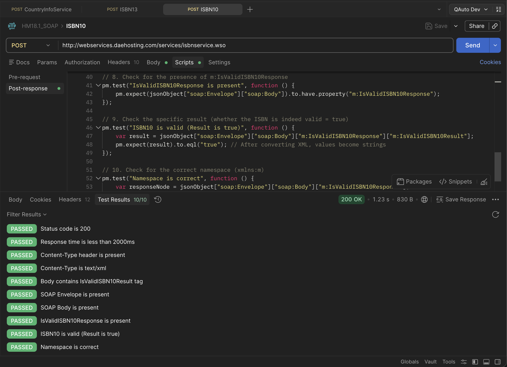
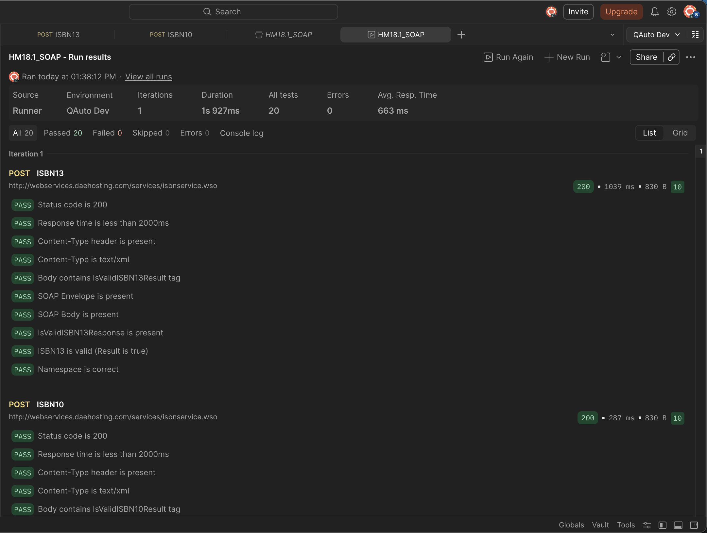

# 📚 SOAP API Testing: Book ISBN Validation

This folder contains a Postman collection with automated tests for a public SOAP API service that validates standard book numbers (ISBN).

The project demonstrates skills in testing web services based on the SOAP protocol, analyzing XML responses, and writing JavaScript scripts (Postman Tests) to verify both headers and response bodies.

## 🛠 Technologies & Tools
* **Postman** (API Development & Testing)
* **SOAP / XML** (Protocol & Data Format)
* **JavaScript** (Test Automation in Postman)

## 📌 API Description
The service allows checking the validity of standard ISBN-10 and ISBN-13 book numbers. The validation is performed by mathematically calculating the checksum.

* **Base URL:** `http://webservices.daehosting.com/services/isbnservice.wso`
* **Method:** `POST`
* **Content-Type:** `text/xml; charset=utf-8`

## 🚀 Tested Endpoints (Requests)

The collection includes two main requests, each covered by 10 automated tests:

1. **`IsValidISBN13`** — validation of a 13-digit ISBN format (e.g., `978-1-4612-9090-2`).

2. **`IsValidISBN10`** — validation of a 10-digit ISBN format (e.g., `0-19-852663-6`).

## ✅ Test Coverage (Test Scenarios)

For each SOAP request, comprehensive checks are implemented at the protocol, header, and XML body parsing levels. The Postman `xml2Json()` function is utilized to convert the XML response into a JSON object for detailed structural analysis.

**Basic Checks (Protocol & Headers):**
* Status code verification (Status code is `200 OK`).
* Performance check (Response time is less than 2000ms).
* Verification of the required `Content-Type` header presence.
* Validation of the `Content-Type` header value (must include `text/xml`).

**Response Body Checks (Body & XML Parsing):**
* Basic search for the key result tag in the raw response text.
* Verification of the root `<soap:Envelope>` tag presence.
* Verification of the `<soap:Body>` tag inside the Envelope.
* Validation of the method's response tag (e.g., `m:IsValidISBN13Response`).
* Exact validation of the result (expected `true` for valid numbers).
* Verification of the XML namespace correctness (Namespace `xmlns:m`).

## ⚙️ How to Run Tests Locally

1. Clone this repository or download the `HM18.1_SOAP.json` collection file.
2. Open **Postman**.
3. Click the **Import** button in the top left corner and select the downloaded file.
4. Open the imported "Book ISBN Numbers" collection.
5. Click on the three dots next to the collection name and select **Run collection**.
6. Ensure both requests are selected, and click **Run Book ISBN Numbers** to see the results of all 20 tests.

---
*This project was completed as part of a practical assignment on SOAP API testing.*