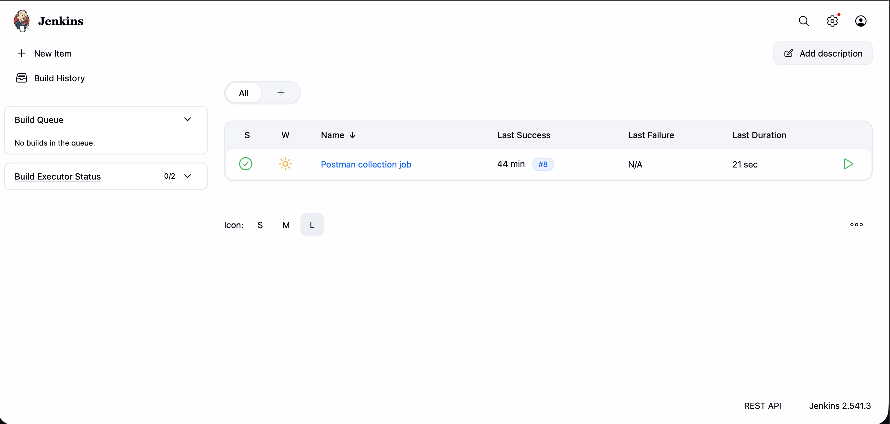
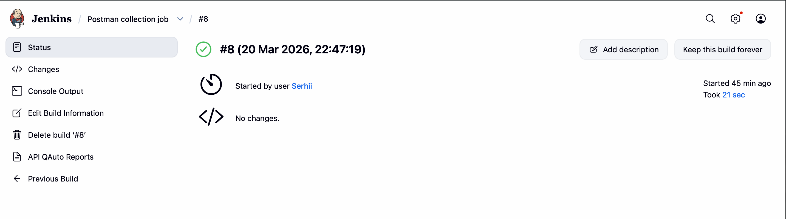

# 🏗️ CI/CD Foundation & API Test Automation: Postman + Jenkins

This project demonstrates the skills of deploying and configuring **Jenkins** as a key tool for Continuous Integration, alongside a fully automated **Postman API Test Suite**. 
The project covers the full cycle: from server installation on macOS to the creation and successful execution of an automated End-to-End (E2E) API testing Job, including advanced HTML test reporting.

## 🛠 Technologies & Tools

* **Postman & Newman:** API Test Automation & CLI execution
* **JavaScript:** Pre-request and Test scripts (Dynamic variables, Date generation via `moment.js`)
* **Jenkins LTS:** Automation Server
* **macOS / Homebrew:** Infrastructure management
* **Java 17 / OpenJDK & Node.js:** Runtime environments
* **Shell Scripting:** Build steps execution
* **HTML Publisher / Newman Reporter HTMLExtra:** Test Reporting

## 📌 Project Description

The goal of this project was to create a stable local CI/CD environment and automate a complex REST API testing flow. The main focus was on the correct configuration of system dependencies, ensuring the uninterrupted operation of the CI server, and automating the visualization of test results.

**API Testing Scope (QAuto Project):**
* **Dynamic Data Handling:** Generating unique test users and calculating current dates for `Car Expenses` on the fly.
* **Complex E2E Flows:** Profile updates, seamless Password changes (handling dynamic `oldPassword` and `newPassword` states in environments), and Login/Logout session management.
* **Data Teardown:** Automated deletion of the created user after the test run to keep the database clean.
* **Negative Testing:** Extensive field validation checks for authentication constraints (password length, missing digits, case sensitivity, etc.).
* **Cross-Environment Execution:** Running the same test suite flawlessly across `dev` and `prod` environments.

**Jenkins Infrastructure:**
* **Platform:** Localhost (port 8080)
* **Service Type:** Background Daemon (via brew services)
* **Access Control:** Secured via Administrator account

## 🚀 Deployment Steps (Implementation)

The setup and automation process included the following key stages:

1. **Environment Preparation:** Installation of OpenJDK 17 and Jenkins LTS via the Homebrew package manager.
2. **Service Initialization:** Launching Jenkins as a background service and performing initial unlock.
3. **Plugin & Dependency Configuration:** * Installation of the standard set of Jenkins plugins (Pipeline, Git, Build Executor Status) and QA-specific reporting tools like **HTML Publisher**.
    * Installation of Node.js dependencies in the build environment (`npm install newman newman-reporter-htmlextra`).
4. **Postman Collection Development:** Scripting dynamic variable extraction, state management across requests, and automated authorization passing.
5. **Job Creation:** Configuration of a **Freestyle Project** that executes the Newman CLI runner against multiple environments and simulates real-world test execution.

## ✅ Build Results & Test Reporting

The following scenarios were implemented and verified for the created Job:

* **Workspace Initialization:** Verification of the project's working directory creation.
* **Automated Test Execution:** Newman successfully runs all requests and assertions per environment without manual intervention (`SUCCESS`).
* **Console Output Analysis:** Validation of system command output, status codes (e.g., 200, 201, 400), and response time logging.
* **Advanced Test Report Generation:** * Integration of the **HTML Publisher** plugin to display these reports directly in the Jenkins dashboard.
    * Archiving of build artifacts for both `dev` and `prod` environments for further analysis.

### 📊 Visuals & Reports




Detailed test run reports generated by `newman-reporter-htmlextra` can be found here:
* 📄 **[Dev Environment Test Report](report_dev.html)**
* 📄 **[Prod Environment Test Report](report_prod.html)**

*(Note: Click the links above to view the source, or download the HTML files and open them in any browser to see the interactive UI reports).*

## ⚙️ How to Access & Run Locally

1. Ensure you have **Homebrew** and **Node.js** installed.
2. Start Jenkins:
   ```bash
   brew services start jenkins-lts
   ```
3. Access Jenkins at `http://localhost:8080`.
4. To run the Postman collection locally via Newman (example):
   ```bash
   npm install -g newman newman-reporter-htmlextra
   newman run test.json -e dev.json --reporters cli,htmlextra --reporter-htmlextra-export report_dev.html
   ```