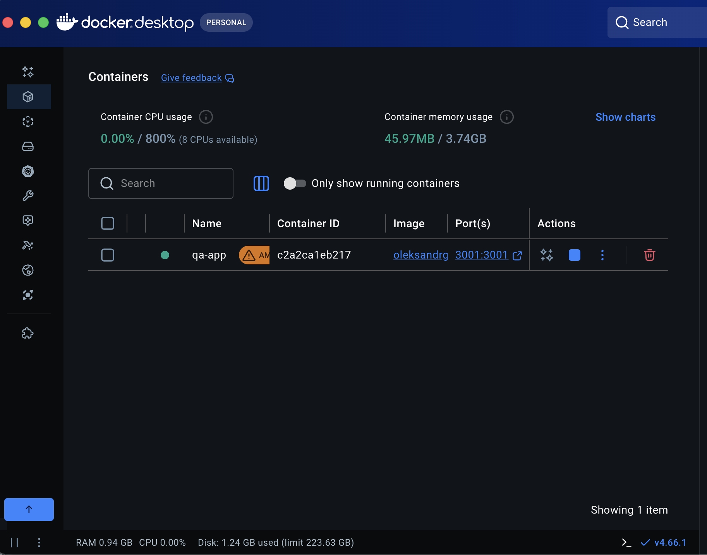
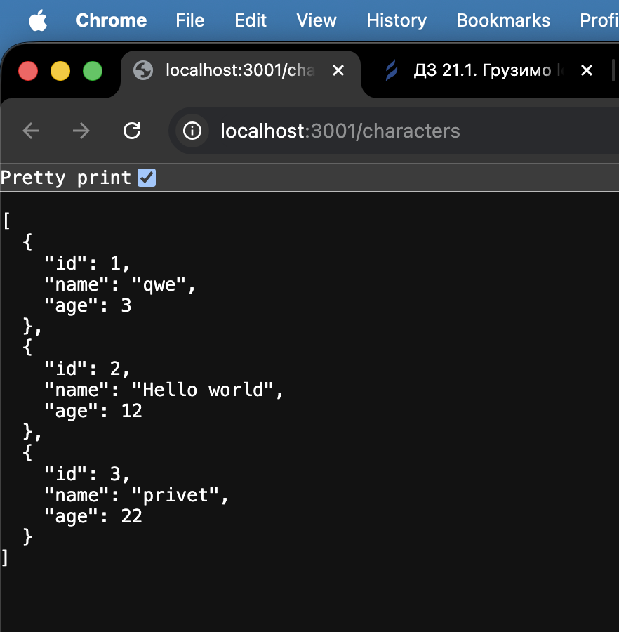
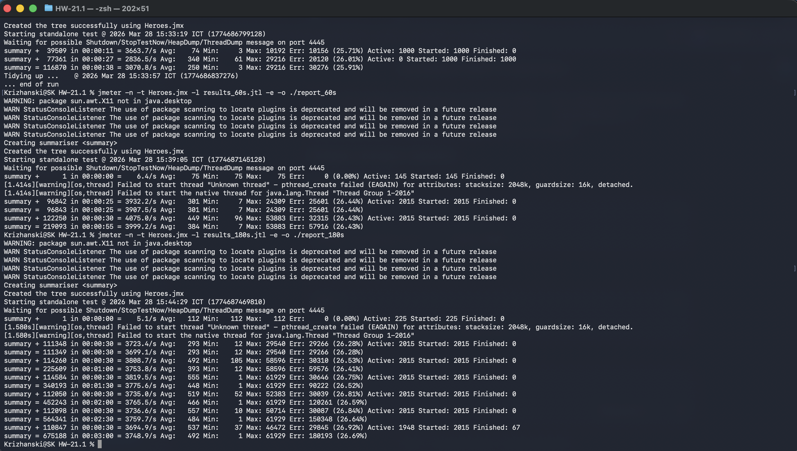
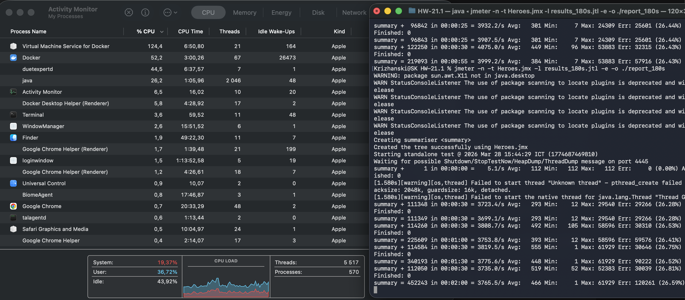

# API Load & Stress Testing with JMeter and Docker

## 📌 Project Overview
This project demonstrates a comprehensive approach to API load and stress testing. The goal was to deploy a local REST API server using Docker and perform various load-testing scenarios using Apache JMeter in CLI (Non-GUI) mode to evaluate the server's performance, stability, and system resource consumption under heavy traffic.

## 🛠 Tech Stack
* **Containerization:** Docker
* **Load Testing Tool:** Apache JMeter (v5.6.3)
* **OS:** macOS Tahoe (Apple Silicon)
* **Target Application:** A local Node.js REST API managing a "Characters" database.

---

## 🚀 Stage 1: Environment Setup

First, I needed to set up the test environment by deploying the target application locally via Docker. Since I am running macOS on Apple Silicon (ARM64 architecture), and the provided Docker image was built for AMD64, I used the `--platform linux/amd64` flag to utilize Rosetta emulation.

```bash
docker run -d -p 3001:3001 --name qa-app --platform linux/amd64 oleksandrgolubishko/qa_pro_rest_app
```



To verify the successful deployment, I accessed the API via a web browser. The server responded correctly with a JSON array of characters.



---

## ⚙️ Stage 2: JMeter Test Plan Preparation

I created a robust JMeter Test Plan (`Heroes.jmx`) to simulate real user behavior. 
1. **Variables:** Configured User Defined Variables for `url` (`localhost`) and `port` (`3001`) to make the script easily adaptable for different environments.
2. **HTTP Header Manager:** Added `Content-Type: application/json` for proper request formatting.
3. **Listeners:** Added **Aggregate Report** and **Graph Results** to monitor performance metrics.
4. **API Endpoints Implemented:**
   * `GET /characters` (Retrieve all characters)
   * `POST /character` (Create a new character). I used JMeter functions `${__RandomString}` and `${__Random}` to generate unique names and ages, preventing database duplicate errors during high concurrency.
   * `GET /character/1` (Retrieve a character by ID)
   * `PUT /character/1` (Update a character)

---

## 📊 Stage 3: Load Testing Execution (Iteration-based)

To ensure accurate results and prevent the JMeter GUI from consuming excessive RAM, all tests were executed via the Command Line Interface (CLI). 



### Test 1: Baseline Load
* **Configuration:** 100 Threads, 1s Ramp-up, 1 Loop Count.
* **Results Data:** [results_1.jtl](./results_1.jtl)

**Execution Log:**
```text
Creating summariser <summary>
Created the tree successfully using Heroes.jmx
Starting standalone test @ 2026 Mar 28 15:25:53 ICT (1774686353700)
Waiting for possible Shutdown/StopTestNow/HeapDump/ThreadDump message on port 4445
summary =    400 in 00:00:01 =  394.9/s Avg:     8 Min:     0 Max:   145 Err:   100 (25.00%)
Tidying up ...    @ 2026 Mar 28 15:25:54 ICT (1774686354803)
... end of run
```

### Test 2: Moderate Load
* **Configuration:** 1000 Threads, 1s Ramp-up, 2 Loop Count.
* **Results Data:** [results_2.jtl](./results_2.jtl)

**Execution Log:**
```text
Creating summariser <summary>
Created the tree successfully using Heroes.jmx
Starting standalone test @ 2026 Mar 28 15:27:39 ICT (1774686459244)
Waiting for possible Shutdown/StopTestNow/HeapDump/ThreadDump message on port 4445
summary =   8000 in 00:00:03 = 2625.5/s Avg:   169 Min:     0 Max:  2032 Err:  2000 (25.00%)
Tidying up ...    @ 2026 Mar 28 15:27:42 ICT (1774686462380)
... end of run
```

### Test 3: High Load & OS Limits Encountered
* **Configuration:** 5000 Threads, 1s Ramp-up, 4 Loop Count.
* **Results Data:** [results_3.jtl](./results_3.jtl)
* **Observation:** During this test, my macOS hit its native thread limit (`pthread_create failed (EAGAIN)`). The OS prevented Java from creating more than ~2000 concurrent threads, proving that client-side hardware/OS limits must be considered during extreme load testing.

**Execution Log:**
```text
Creating summariser <summary>
Created the tree successfully using Heroes.jmx
Starting standalone test @ 2026 Mar 28 15:28:54 ICT (1774686534692)
Waiting for possible Shutdown/StopTestNow/HeapDump/ThreadDump message on port 4445
[1.504s][warning][os,thread] Failed to start thread "Unknown thread" - pthread_create failed (EAGAIN) for attributes: stacksize: 2048k, guardsize: 16k, detached.
[1.505s][warning][os,thread] Failed to start the native thread for java.lang.Thread "Thread Group 1-2038"
summary +  14600 in 00:00:05 = 2794.8/s Avg:   178 Min:     1 Max:  4827 Err:  3651 (25.01%) Active: 1131 Started: 2037 Finished: 906
```

---

## 🔥 Stage 4: Stress Testing with Duration Assertions

For the second phase, I added a **Duration Assertion** of `500ms` globally to the Thread Group. If the API took longer than half a second to respond, the request was marked as failed. I also switched to Infinite Loop Count with a fixed time duration to simulate continuous traffic.

### Test 4: 30 Seconds Stress Test
* **Configuration:** 1000 Threads, 2s Ramp-up, Infinite Loops, Duration: 30s.
* **Results Data:** [results_30s.jtl](./results_30s.jtl)

**Execution Log:**
```text
Creating summariser <summary>
Created the tree successfully using Heroes.jmx
Starting standalone test @ 2026 Mar 28 15:33:19 ICT (1774686799128)
Waiting for possible Shutdown/StopTestNow/HeapDump/ThreadDump message on port 4445
summary +  39509 in 00:00:11 = 3663.7/s Avg:    74 Min:     3 Max: 10192 Err: 10156 (25.71%) Active: 1000 Started: 1000 Finished: 0
summary +  77361 in 00:00:27 = 2836.5/s Avg:   340 Min:    61 Max: 29216 Err: 20120 (26.01%) Active: 0 Started: 1000 Finished: 1000
summary = 116870 in 00:00:38 = 3070.8/s Avg:   250 Min:     3 Max: 29216 Err: 30276 (25.91%)
Tidying up ...    @ 2026 Mar 28 15:33:57 ICT (1774686837276)
... end of run
```

### Test 5: 60 Seconds Stress Test
* **Configuration:** 5000 Threads, 3s Ramp-up, Infinite Loops, Duration: 60s.
* **Results Data:** [results_60s.jtl](./results_60s.jtl)

**Execution Log:**
```text
Creating summariser <summary>
Created the tree successfully using Heroes.jmx
Starting standalone test @ 2026 Mar 28 15:39:05 ICT (1774687145128)
Waiting for possible Shutdown/StopTestNow/HeapDump/ThreadDump message on port 4445
summary +      1 in 00:00:00 =    6.4/s Avg:    75 Min:    75 Max:    75 Err:     0 (0.00%) Active: 145 Started: 145 Finished: 0
[1.414s][warning][os,thread] Failed to start thread "Unknown thread" - pthread_create failed (EAGAIN) for attributes: stacksize: 2048k, guardsize: 16k, detached.
[1.414s][warning][os,thread] Failed to start the native thread for java.lang.Thread "Thread Group 1-2016"
summary +  96842 in 00:00:25 = 3932.2/s Avg:   301 Min:     7 Max: 24309 Err: 25601 (26.44%) Active: 2015 Started: 2015 Finished: 0
summary =  96843 in 00:00:25 = 3907.5/s Avg:   301 Min:     7 Max: 24309 Err: 25601 (26.44%)
summary + 122250 in 00:00:30 = 4075.0/s Avg:   449 Min:    96 Max: 53883 Err: 32315 (26.43%) Active: 2015 Started: 2015 Finished: 0
summary = 219093 in 00:00:55 = 3999.2/s Avg:   384 Min:     7 Max: 53883 Err: 57916 (26.43%)
```

### Test 6: 180 Seconds Extreme Stress Test
* **Configuration:** 10,000 Threads, 5s Ramp-up, Infinite Loops, Duration: 180s.
* **Results Data:** [results_180s.jtl](./results_180s.jtl)
* **Observation:** During this massive load, the local system was heavily utilized. The Java process (JMeter) and Docker fought for CPU resources, which is typical for running both the test client and the target server on the same physical machine. The OS thread limit was hit again, stabilizing at ~2000 concurrent threads. 



**Execution Log:**
```text
Creating summariser <summary>
Created the tree successfully using Heroes.jmx
Starting standalone test @ 2026 Mar 28 15:44:29 ICT (1774687469810)
Waiting for possible Shutdown/StopTestNow/HeapDump/ThreadDump message on port 4445
summary +      1 in 00:00:00 =    5.1/s Avg:   112 Min:   112 Max:   112 Err:     0 (0.00%) Active: 225 Started: 225 Finished: 0
[1.580s][warning][os,thread] Failed to start thread "Unknown thread" - pthread_create failed (EAGAIN) for attributes: stacksize: 2048k, guardsize: 16k, detached.
[1.580s][warning][os,thread] Failed to start the native thread for java.lang.Thread "Thread Group 1-2016"
summary + 111348 in 00:00:30 = 3723.4/s Avg:   293 Min:    12 Max: 29540 Err: 29266 (26.28%) Active: 2015 Started: 2015 Finished: 0
summary = 111349 in 00:00:30 = 3699.1/s Avg:   293 Min:    12 Max: 29540 Err: 29266 (26.28%)
summary + 114260 in 00:00:30 = 3808.7/s Avg:   492 Min:   105 Max: 58596 Err: 30310 (26.53%) Active: 2015 Started: 2015 Finished: 0
summary = 225609 in 00:01:00 = 3753.8/s Avg:   393 Min:    12 Max: 58596 Err: 59576 (26.41%)
summary + 114584 in 00:00:30 = 3819.5/s Avg:   555 Min:     1 Max: 61929 Err: 30646 (26.75%) Active: 2015 Started: 2015 Finished: 0
summary = 340193 in 00:01:30 = 3775.6/s Avg:   448 Min:     1 Max: 61929 Err: 90222 (26.52%)
summary + 112050 in 00:00:30 = 3735.0/s Avg:   519 Min:    52 Max: 52383 Err: 30039 (26.81%) Active: 2015 Started: 2015 Finished: 0
summary = 452243 in 00:02:00 = 3765.5/s Avg:   466 Min:     1 Max: 61929 Err: 120261 (26.59%)
summary + 112098 in 00:00:30 = 3736.6/s Avg:   557 Min:    10 Max: 50714 Err: 30087 (26.84%) Active: 2015 Started: 2015 Finished: 0
summary = 564341 in 00:02:30 = 3759.7/s Avg:   484 Min:     1 Max: 61929 Err: 150348 (26.64%)
summary + 110847 in 00:00:30 = 3694.9/s Avg:   537 Min:    37 Max: 46472 Err: 29845 (26.92%) Active: 1948 Started: 2015 Finished: 67
summary = 675188 in 00:03:00 = 3748.9/s Avg:   492 Min:     1 Max: 61929 Err: 180193 (26.69%)
```

## 🎯 Conclusion
This project successfully demonstrated the setup and execution of load and stress tests. Key takeaways include understanding how to structure parameterized requests, generating dynamic data to avoid DB collisions, and observing system behavior under extreme limits. The appearance of `EAGAIN` thread limit errors was a valuable lesson in distinguishing between application bottlenecks and client-side hardware/OS limitations.

*All interactive HTML reports (`report_*` folders) are available in this repository for deeper analysis of Throughput and Response Times.*