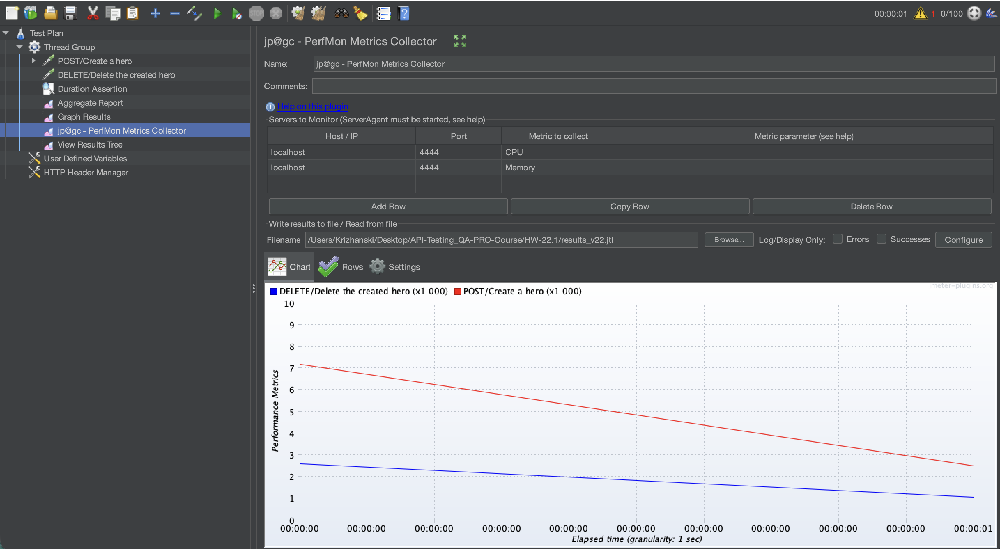
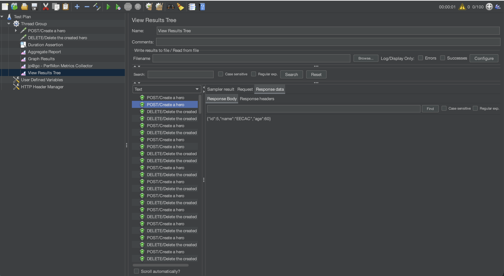
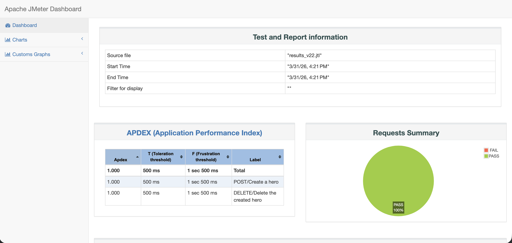

# API Performance Optimization, Correlation & Resource Monitoring

## 📌 Project Overview
This project demonstrates advanced API load testing techniques using Apache JMeter. The primary focus of this assignment was to implement **Dynamic Data Correlation** (passing data between requests), establish **Infrastructure Resource Monitoring** (CPU/RAM) during load tests, and troubleshoot environment-specific port conflicts. 

## 🛠 Tech Stack
* **Containerization:** Docker
* **Load Testing Tool:** Apache JMeter (v5.6.3)
* **Monitoring:** PerfMon Server Agent
* **OS:** macOS Tahoe (Apple Silicon)
* **Target Application:** Local Node.js REST API ("Characters" database).

---

## 🚀 Stage 1: Environment Setup & Troubleshooting (Port Conflict Resolution)

Initially, the goal was to deploy the target application on port `8080`. However, during the initial test runs, all requests failed with a `403 Forbidden` error and a `No valid crumb was included in the request` message. 

**Root Cause Analysis:** Through debugging the Response Body in JMeter, I discovered that my local **Jenkins** CI server was already occupying port `8080`. JMeter was accidentally hitting Jenkins' CSRF protection instead of my target API.

**Resolution:** To resolve this service collision without shutting down Jenkins, I stopped the initial Docker container and redeployed the API on port `3001` using the following command:

```bash
docker stop qa-app-22 && docker rm qa-app-22
docker run -d -p 3001:3001 --name qa-app-fixed --platform linux/amd64 oleksandrgolubishko/qa_pro_rest_app
```

I then updated the `User Defined Variables` in JMeter to target port `3001`, successfully resolving the conflict.

---

## ⚙️ Stage 2: JMeter Test Plan & Dynamic Correlation

To simulate a realistic user journey, I needed to create a character and immediately delete that specific character. This required **Correlation**—extracting a dynamic value from one response and injecting it into the next request.

1. **Variables & Headers:** Configured `${url}` as `localhost` and added an HTTP Header Manager for `Content-Type: application/json`.
2. **POST Request (Create Hero):** Created a payload using JMeter functions `${__RandomString}` and `${__Random}` to generate unique users.
   
   

3. **JSON Extractor:** Attached a Post-Processor to the POST request. It used the JSON Path `$.id` to capture the newly generated ID from the server's response and stored it in a variable named `created_id`.
4. **DELETE Request (Delete Hero):** Configured the path as `/character/${created_id}`. This ensured the exact character created in step 2 was instantly deleted, preventing database bloat during the load test.

   

---

## 📈 Stage 3: Infrastructure Monitoring Setup (PerfMon)

To monitor how the load affects the host machine's hardware, I integrated the **PerfMon Metrics Collector**.

1. **Server Agent Installation:** Downloaded the `ServerAgent-2.2.3.zip` from GitHub. Extracted it on my macOS environment, granted execution permissions (`chmod +x startAgent.sh`), and started the agent on port `4444`.
2. **JMeter Configuration:** Installed the PerfMon plugin via JMeter Plugins Manager. Added the `jp@gc - PerfMon Metrics Collector` listener to track **CPU** and **Memory** metrics via `localhost:4444`, saving the raw data to `results_v22.jtl`.

   

---

## 🟢 Stage 4: GUI Debugging & Verification

Before executing the high-load CLI test, I ran a single thread in the JMeter GUI to verify the correlation logic. The `View Results Tree` confirmed a `200 OK` for both requests. The POST request successfully returned an ID, and the DELETE request successfully consumed that exact ID.



---

## 📊 Stage 5: CLI Execution & HTML Reporting

With the script verified and the Server Agent running, I executed the load test (100 concurrent threads) entirely via the Command Line Interface (CLI) to generate a professional HTML Dashboard.

**Execution Command:**
```bash
jmeter -n -t Heroes_v22.jmx -l results_v22.jtl -e -o ./report_v22_final
```

**Execution Log:**
```text
Creating summariser <summary>
Created the tree successfully using Heroes_v22.jmx
Starting standalone test @ 2026 Mar 31 16:21:15 ICT (1774948875175)
Waiting for possible Shutdown/StopTestNow/HeapDump/ThreadDump message on port 4445
summary =    200 in 00:00:01 =  198.4/s Avg:     3 Min:     0 Max:    38 Err:     0 (0.00%)
Tidying up ...    @ 2026 Mar 31 16:21:16 ICT (1774948876294)
... end of run
```

### Final Dashboard Results
The test concluded with a **100% Pass Rate (0 Errors)**. The average response time was an incredibly fast **~3.96ms**. The PerfMon data indicated that CPU and Memory utilization remained entirely stable, proving that the application and infrastructure can easily handle this level of concurrency without bottlenecks.



---

## 🎯 Conclusion
This project successfully validated the stability of the API while demonstrating advanced QA engineering skills. Key accomplishments include setting up seamless request correlation using JSON Extractors, integrating OS-level hardware monitoring with PerfMon, and successfully debugging and resolving a real-world port collision issue between a CI/CD server and a containerized testing environment.