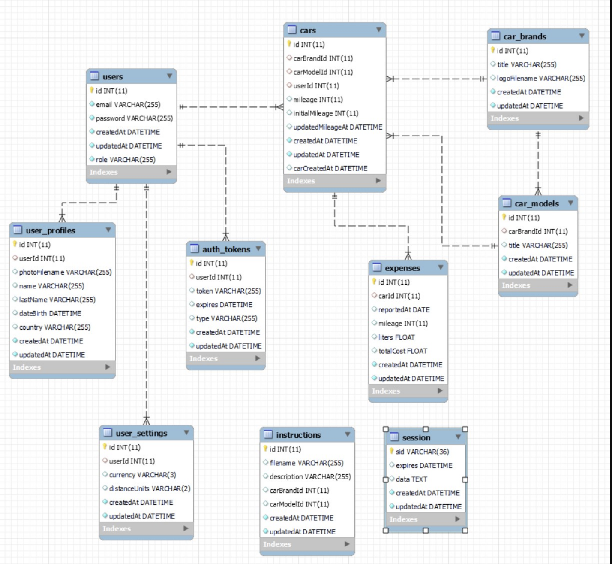
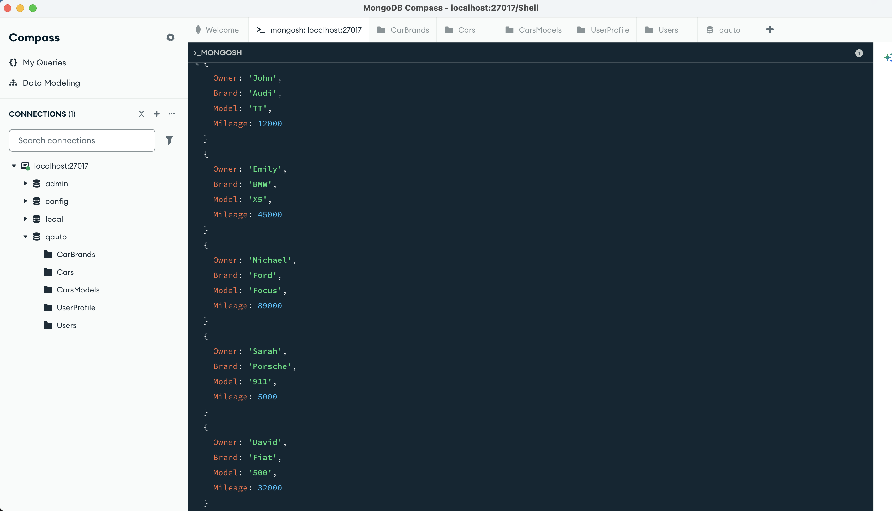

# SQL to MongoDB Migration & Data Modeling: "qauto" Project

## 📌 Project Overview
The main objective of this task is to use the existing SQL database schema as a reference to implement several MongoDB collections that preserve the core business logic of the `qauto` application. In simple terms, this project demonstrates a partial data migration to MongoDB. Additionally, the assignment focuses on implementing **Document Referencing** (linking documents via `ObjectId`), establishing 1:1 and One-to-Many relationships, and troubleshooting environment data duplication issues.



## 🛠 Tech Stack
* **Database:** MongoDB Community Server
* **GUI / CLI Tool:** MongoDB Compass & `mongosh`
* **OS:** macOS (Apple Silicon M1)
* **Package Manager:** Homebrew
* **Data Format:** JSON

---

## 🚀 Stage 1: Environment Setup on macOS M1

To ensure a clean and manageable local database server on my Apple Silicon machine, I utilized Homebrew to install and run the MongoDB service.

**Installation & Configuration:**
```bash
# Add the official MongoDB repository
brew tap mongodb/brew

# Install the MongoDB Community Server and Database Tools (for export)
brew install mongodb-community
brew install mongodb-database-tools

# Start MongoDB as a background macOS service
brew services start mongodb-community
```
Once the service was running, I connected to `mongodb://localhost:27017` using **MongoDB Compass** and initialized a new database named `qauto`.

---

## ⚙️ Stage 2: Database Design & Referencing Strategy

In SQL, tables are linked using `FOREIGN KEY` constraints. In MongoDB, I replicated this relational logic using the **Referencing** approach—storing the `_id` (ObjectId) of one document inside another. I created 5 specific collections:
1. `CarBrands`
2. `CarsModels`
3. `Users`
4. `UserProfile`
5. `Cars`

---

## 📈 Stage 3: Building the Foundation (Brands & Models) & Troubleshooting

I started by populating the independent collections using the integrated `mongosh` terminal. 

**1. Creating Brands:**
```javascript
db.CarBrands.insertMany([
  { title: "Audi", logoFilename: "audi.png" },
  { title: "BMW", logoFilename: "bmw.png" },
  { title: "Ford", logoFilename: "ford.png" },
  { title: "Porsche", logoFilename: "porsche.png" },
  { title: "Fiat", logoFilename: "fiat.png" }
]);
```
*Note: I executed `db.CarBrands.find()` to extract the dynamically generated `ObjectId`s for the next step.*

**2. Creating Models (One-to-Many Relationship):**
To link models to their parent brands, I extracted the dynamically generated `ObjectId`s from the `CarBrands` collection and used them as pointers in the `carBrandId` field.

```javascript
db.CarsModels.insertMany([
  { title: "TT", carBrandId: ObjectId("69d230ca94800c8ff0cbb327") }, // Audi
  { title: "X5", carBrandId: ObjectId("69d231a394800c8ff0cbb329") }, // BMW
  { title: "Focus", carBrandId: ObjectId("69d231a394800c8ff0cbb32a") }, // Ford
  { title: "911", carBrandId: ObjectId("69d231a394800c8ff0cbb32b") }, // Porsche
  { title: "500", carBrandId: ObjectId("69d231a394800c8ff0cbb32c") }  // Fiat
]);
```

### 🐛 Troubleshooting: Data Duplication (QA Mindset)
During the creation of the `CarsModels` collection, I accidentally executed the insert command multiple times, resulting in duplicate models (e.g., multiple "X5" entries pointing to BMW). 

**Root Cause:** Unlike SQL tables with strict constraints, MongoDB only enforces uniqueness on the primary `_id` field by default. It gladly accepted the duplicate objects and assigned them new IDs.

**Resolution:** In a real-world testing environment, duplicates cause UI bugs (e.g., duplicated dropdown items) and skewed statistics. To ensure data integrity, I performed a surgical cleanup:
1. Wiped the duplicated collection: `db.CarsModels.deleteMany({})`
2. Re-inserted the exact 5 unique models. 
*(For future prevention, I noted that a unique compound index `db.CarsModels.createIndex({ title: 1, carBrandId: 1 }, { unique: true })` should be applied).*

---

## 🟢 Stage 4: Digital Identities (Users & Profiles)

Next, I populated the user data and established a **1:1 relationship** between a User and their Settings Profile.

**1. Creating Users:**
```javascript
db.Users.insertMany([
  { name: "John", lastName: "Smith", email: "john.smith@example.com" },
  { name: "Emily", lastName: "Johnson", email: "emily.j@testmail.com" },
  { name: "Michael", lastName: "Brown", email: "m.brown@provider.net" },
  { name: "Sarah", lastName: "Davis", email: "sarah.davis@webmail.com" },
  { name: "David", lastName: "Wilson", email: "d.wilson@coolsite.com" }
]);
```

**2. Creating Profiles (1:1 Relationship):**
I linked each profile to a specific user by storing the user's `_id` in the `userId` field.
```javascript
db.UserProfile.insertMany([
  { userId: ObjectId('69d2343d94800c8ff0cbb33a'), distanceUnits: "miles", currency: "usd" },
  { userId: ObjectId('69d2343d94800c8ff0cbb33b'), distanceUnits: "miles", currency: "usd" },
  // ... repeated for all 5 users
]);
```

---

## 📊 Stage 5: Final Assembly (Cars Collection)

The `Cars` collection acts as the central hub of the database. It stores the relationship between a User, a Brand, and a Model, effectively acting as a "Join Table" in document form.

```javascript
db.Cars.insertMany([
  { 
    userId: ObjectId('69d2343d94800c8ff0cbb33a'),     // John Smith
    carBrandId: ObjectId('69d230ca94800c8ff0cbb327'), // Audi
    carModelId: ObjectId('69d2339c94800c8ff0cbb335'), // TT
    mileage: 12000 
  },
  { 
    userId: ObjectId('69d2343d94800c8ff0cbb33b'),     // Emily Johnson
    carBrandId: ObjectId('69d231a394800c8ff0cbb329'), // BMW
    carModelId: ObjectId('69d2339c94800c8ff0cbb336'), // X5
    mileage: 45000 
  },
  { 
    userId: ObjectId('69d2343d94800c8ff0cbb33c'),     // Michael Brown
    carBrandId: ObjectId('69d231a394800c8ff0cbb32a'), // Ford
    carModelId: ObjectId('69d2339c94800c8ff0cbb337'), // Focus
    mileage: 89000 
  },
  { 
    userId: ObjectId('69d2343d94800c8ff0cbb33d'),     // Sarah Davis
    carBrandId: ObjectId('69d231a394800c8ff0cbb32b'), // Porsche
    carModelId: ObjectId('69d2339c94800c8ff0cbb338'), // 911
    mileage: 5000 
  },
  { 
    userId: ObjectId('69d2343d94800c8ff0cbb33e'),     // David Wilson
    carBrandId: ObjectId('69d231a394800c8ff0cbb32c'), // Fiat
    carModelId: ObjectId('69d2339c94800c8ff0cbb339'), // 500
    mileage: 32000 
  }
]);
```

> 💡 **Core Concept:** By storing IDs instead of text, if a brand name is updated in its parent collection, the change is automatically reflected across all linked car entries without data duplication.

---

## 💻 Stage 6: Execution Log & Verification

Below is the overall execution log from the `mongosh` shell. I used an **Aggregation Pipeline** with `$lookup` to join the collections and verify that all `ObjectId` references correctly resolve to their corresponding human-readable data.



### Exported Data Files
The final, verified collections were exported to JSON format for review:
* 📄 [CarBrands.json](./Car_Brands.json)
* 📄 [CarsModels.json](./Cars_Models.json)
* 📄 [Users.json](./Users_.json)
* 📄 [UserProfile.json](./User_Profile.json)
* 📄 [Cars.json](./Cars_.json)

---

## 🎯 Conclusion
This project successfully validated my ability to design, deploy, and manipulate a Document-Oriented database. Key accomplishments include configuring a local MongoDB server on macOS via Homebrew, successfully modeling complex relational data (1:1 and One-to-Many) using ObjectId referencing, and applying a strict QA mindset to troubleshoot and resolve data integrity issues (duplicates) directly via the command line interface.