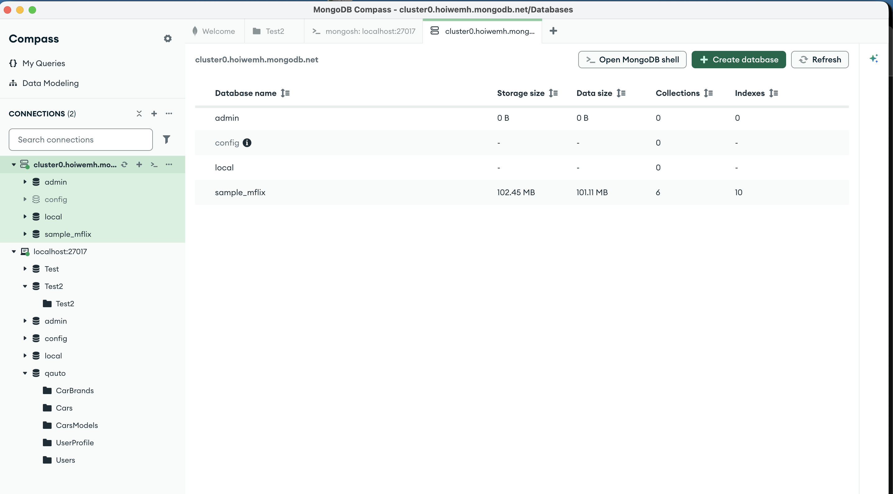
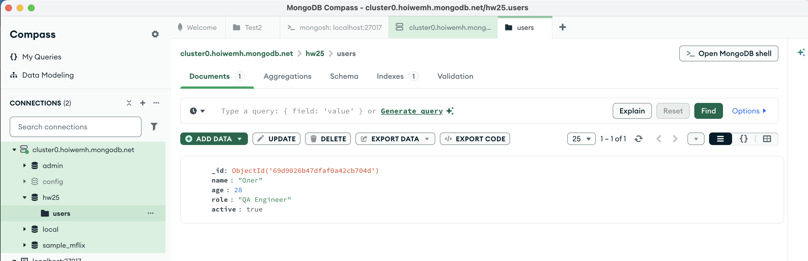
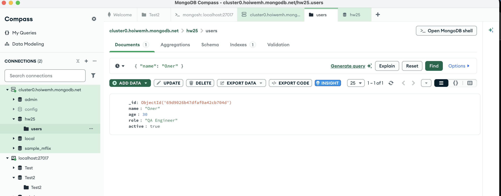
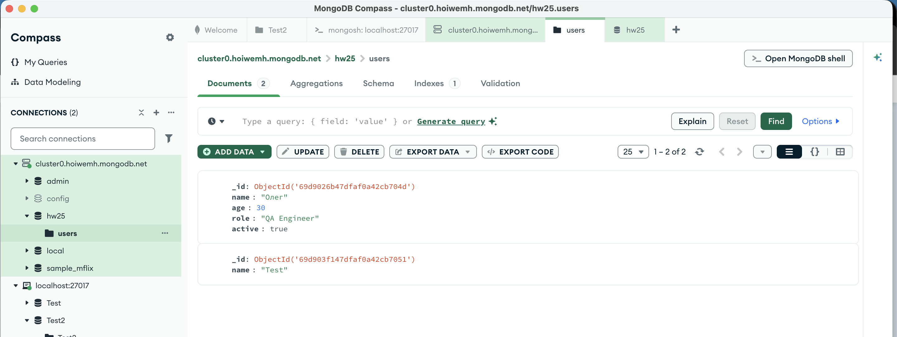
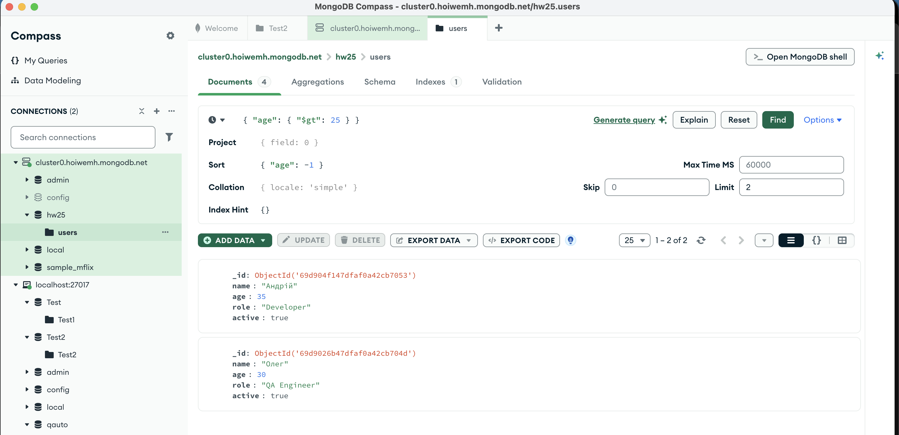

# Тестування MongoDB Atlas Cluster: HW 25.1
---

## 🚀 Крок 1: Підключення Atlas Cluster до MongoDB Compass
Для роботи було створено безкоштовний кластер (Shared Cluster M0) у хмарі MongoDB Atlas. Налаштовано безпечний доступ через IP Access List та створено користувача бази даних. Підключення до локального клієнта Compass пройшло успішно.

---

## 🛠 Крок 2: Виконання CRUD операцій

В рамках тестування в колекції `users` було проведено цикл маніпуляції документом.

### 1. Create (Створення)
Був створений новий документ користувача з полями: `name`, `age`, `role` та `active`.

### 2. Read & Update (Читання та Оновлення)
Документ був успішно знайдений у базі. Після цього проведено оновлення даних (зміна віку та статусу користувача). Валідація через Compass підтвердила, що зміни миттєво відобразилися на сервері Atlas.

### 3. Delete (Видалення)
Тестовий документ був видалений. Після видалення виконано повторний пошук, який підтвердив відсутність документа в колекції.

---

## 🔍 Крок 3: Фільтрація та параметри запиту
Для перевірки роботи було використано розширені параметри пошуку:
* **Filter:** Вибір користувачів за умовою віку (`$gt`).
* **Sort:** Сортування результатів за спаданням (`-1`).
* **Limit:** Обмеження кількості виведених документів.

---

**Статус тестування:** 🟢 Passed
